# LM Studio MCP Bridge

[](LICENSE)

A Node.js based Model Context Protocol (MCP) bridge that enables **Antigravity** (and other MCP clients) to interact with locally hosted Large Language Models (LLMs) via **LM Studio**.

## Overview

This bridge acts as a translation layer between the MCP standard and LM Studio's OpenAI-compatible and native administrative APIs. It allows AI assistants to autonomously query, load, and manage local models running on your hardware.

## Features

- 💬 **Dynamic Chat & Vision**: Query local LLMs with text and images. Supports structured JSON output, reasoning, and professional inference controls (`top_p`, `top_k`, `seed`, `stop`, etc.).
- 📂 **Privacy-First RAG**: Semantic search across local directories using local embeddings.
- 📑 **Direct File Interaction**: Read, analyze, and query local files directly.
- 🏗️ **Model Orchestration**: Programmatically load and unload models to manage hardware resources.
- 🤖 **Auto-Model Selection**: Automatically selects the first available loaded model if none is specified.
- 🏷️ **Model Attribution**: Every response clearly identifies which model generated the answer.
- ⚡ **Async Processing**: Offload long-running vision tasks to the background.
- 🏥 **System Monitoring**: Check CPU/Memory health and bridge configuration.

---

## Available Tools (v2.0.0)

The bridge provides a comprehensive suite of **28 tools** categorized for various AI workflows:

### 🗨️ Core Interaction
- `query_local_llm`: Standard text generation. Supports Vision, JSON Schema, and expert parameters (`top_p`, `top_k`, `stop`, `penalty`, `seed`).
- `query_local_llm_stateful`: Advanced stateful query using `/v1/responses`. Supports stateful context, reasoning control, and sampling parameters.
- `analyze_local_image`: Direct image analysis using local vision models.
- `analyze_local_image_async`: Start background image analysis (returns a Task ID).
- `get_bridge_task_status`: Check progress of asynchronous vision tasks.

### 📁 File & Knowledge (RAG)
- `search_local_docs`: Semantic vector search across local document directories. Now uses auto-model selection.
- `get_local_embeddings`: Generate text embeddings for local indexing. Supports batch arrays and auto-model selection.
- `query_local_file`: Read a file and ask questions about its specific content.
- `list_files_in_directory`: Browse local file systems.
- `read_file_content`: Fetch raw content from local files.

### 🤖 Model Management
- `list_local_models`: See all loaded and available models (optionally detailed).
- `load_local_model`: Load a specific model ID into memory/VRAM.
- `unload_local_model`: Free up resources by unloading models.

### 🌐 Mesh & Network (LM Link)
- `get_lm_link_status`: View current network status and all discovered mesh devices.
- `manage_lm_link`: Administrative control to `enable`, `disable`, or `rename` your local Link node.
- `set_preferred_lm_link_device`: Programmatically route AI tasks to a specific remote machine.

### 🛠️ System & Debugging
- `get_system_health`: Monitor bridge machine CPU and Memory usage.
- `check_server_status`: Verify connection to the LM Studio API.
- `get_bridge_config`: View current host, port, and authentication settings.

### 🖥️ CLI Management (Advanced)
- `lms_status`: Show the overall health of the LM Studio daemon and server.
- `lms_ls`: List models currently available on disk (richer than API list).
- `lms_ps`: List models currently loaded in memory (RAM/VRAM).
- `lms_get`: Search for or download models from LM Studio Hub / Hugging Face.
- `lms_import`: Import a local model file (.gguf) into LM Studio.
- `lms_server_control`: Start, stop, or check the status of the inference server.
- `lms_load_cli`: Load models with advanced controls (GPU offload, context length).
- `lms_log_snapshot`: Capture a snapshot of current system logs.
- `lms_runtime_control`: Manage and update the inference runtime engines (engines list, survey hardware).

---

## Usage Examples

### 🧱 Structured Data (JSON Schema)
Force the model to return valid JSON following a specific schema.
```json
{
  "prompt": "Generate a random user profile",
  "json_schema": {
    "type": "object",
    "properties": {
      "name": { "type": "string" },
      "age": { "type": "integer" }
    },
    "required": ["name", "age"]
  }
}
```

```json
{
  "prompt": "What is shown in this architecture diagram?",
  "image_path": "C:/Users/otwo/Desktop/system_init.png"
}
```

### 🧠 Stateful Follow-up (Responses API)
Continue a conversation without re-sending history by using a Response ID.
```json
{
  "input": "Can you explain the previous calculation in more detail?",
  "previous_response_id": "resp_987654321",
  "reasoning_effort": "high"
}
```

## Prerequisites

- **LM Studio**: version 0.3.0+ (with Local Server enabled on port `1234`).
- **Node.js**: v18.0.0 or higher.
- **MCP Client**: Such as Antigravity, Claude Desktop, or any tool that supports the Model Context Protocol.

## Getting Started

### 1. Installation

Clone this repository and install the required dependencies:

```bash
git clone https://github.com/ozwei/lmstudio-mcp-bridge.git
cd lmstudio-mcp-bridge
npm install
```

### 2. Configuration

Create a `.env` file in the root directory (you can copy from `.env.example`) and fill in your LM Studio details:

```env
LM_HOST=localhost
LM_PORT=1234
LM_API_TOKEN=your_token_here
```

> [!NOTE]
> The `.env` file is excluded from Git to protect your sensitive configuration.

### 3. Architecture: Using with LM Link

If you are using **LM Link** to connect multiple devices:

1. **Setup**: Run LM Studio on both your "Server" (powerful machine) and "Client" (where you are coding).
2. **Connectivity**: Enable LM Link to share the server's models with the client.
3. **Bridge Placement**: Run the `lmstudio-mcp-bridge` on your **Client** machine.
4. **Proxying**: Set `LM_HOST=localhost` in your `.env`. The bridge will talk to your local client, which will transparently route requests to the remote models via the secure link.

**Data Flow:**

```mermaid
graph LR
    A["IDE (Antigravity)"] -- MCP Protocol --> B["MCP Bridge (Local Device)"]
    B -- HTTP/JSON --> C["Local LM Studio Client"]
    C -- Secure Tunnel (LM Link) --> D["Remote LM Studio Server"]
    D -- Inference --> E["GPU / Local LLM"]

    style A fill:#3498db,color:#fff,stroke:#2980b9,stroke-width:2px
    style B fill:#9b59b6,color:#fff,stroke:#8e44ad,stroke-width:2px
    style C fill:#2ecc71,color:#fff,stroke:#27ae60,stroke-width:2px
    style D fill:#e67e22,color:#fff,stroke:#d35400,stroke-width:2px
    style E fill:#e74c3c,color:#fff,stroke:#c0392b,stroke-width:2px
```



`IDE (Antigravity/Claude Code) -> MCP Bridge -> Local LM Studio Client -> LM Link -> Remote LM Studio Server`

### 4. Usage in Antigravity

Add the bridge to your MCP settings:

```json
{
  "mcpServers": {
    "lmstudio-bridge": {
      "command": "node",
      "args": ["C:/absolute/path/to/lmstudio-mcp-bridge/src/index.js"]
    }
  }
}
```

## License

This project is licensed under the MIT License - see the [LICENSE](LICENSE) file for details.
